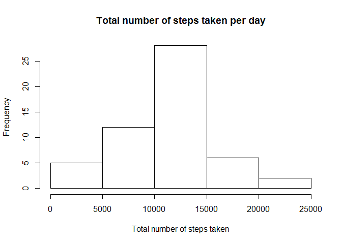
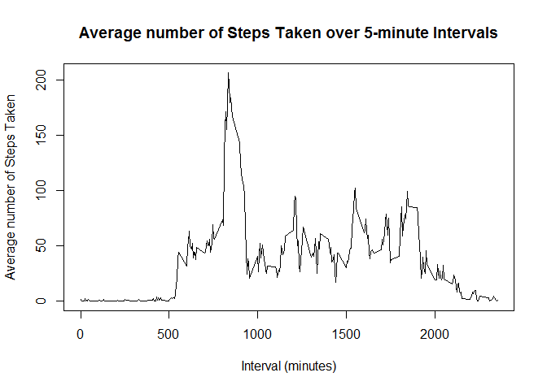
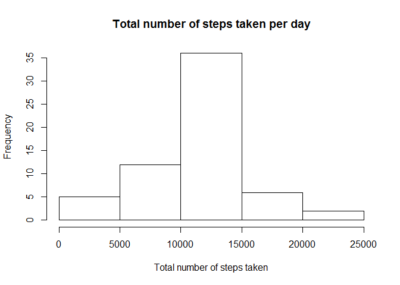

# Course 5 - Project 1


## Loading and preprocessing the data

Loading of the data:


```r
dataset_url <- "https://d396qusza40orc.cloudfront.net/repdata%2Fdata%2Factivity.zip"
download.file(dataset_url, "activity.zip")
unzip("activity.zip", exdir = "activity")

activity_monitoring_data <- read.csv("activity/activity.csv")
```

Preprocessing of the data: 


```r
activity_monitoring_data$date <- as.Date(activity_monitoring_data$date, "%Y-%m-%d")
activity_monitoring_data_remove_NA <- subset(activity_monitoring_data, steps != "NA")
```

Load packages used for data analysis:


```r
library(dplyr)
library(ggplot2)
```

## What is mean total number of steps taken per day?

Calculate the total number of steps taken per day:


```r
activity_monitoring_data_by_date <- group_by(activity_monitoring_data_remove_NA, date)
activity_monitoring_data_total_steps_by_date <- summarize(activity_monitoring_data_by_date, steps = sum(steps))
```

Histogram of the total number of steps taken per day:


```r
hist(activity_monitoring_data_total_steps_by_date$steps, 
     main = "Total number of steps taken per day", 
     xlab = "Total number of steps taken")
```

<!-- -->

Mean number of steps taken per day:


```r
mean_steps <- mean(activity_monitoring_data_total_steps_by_date$steps, na.rm = TRUE)
print(mean_steps)
```

```
## [1] 10766.19
```

Median number of steps taken per day:


```r
median_steps <- median(activity_monitoring_data_total_steps_by_date$steps, na.rm = TRUE)
print(median_steps)
```

```
## [1] 10765
```

## What is the average daily activity pattern?

Time series plot of the 5-minute interval and the average number of steps taken, averaged across all days:


```r
activity_monitoring_data_by_interval <- group_by(activity_monitoring_data_remove_NA, interval)
activity_monitoring_data_mean_steps_by_interval <- summarize(activity_monitoring_data_by_interval, steps = mean(steps))

with (activity_monitoring_data_mean_steps_by_interval, 
      plot(x = interval, 
           y = steps, 
           type = "l", 
           xlab = "Interval (minutes)",
           ylab = "Average number of Steps Taken",
           main = "Average number of Steps Taken over 5-minute Intervals"))
```

<!-- -->

Which 5-minute interval, on average across all the days in the dataset, contains the maximum number of steps?


```r
activity_monitoring_data_mean_steps_by_interval[activity_monitoring_data_mean_steps_by_interval$steps == max(activity_monitoring_data_mean_steps_by_interval$steps), ]$interval
```

```
## [1] 835
```

**The 835 minute interval, on average across all the days in the dataset, contains the maximum number of steps**

## Imputing missing values

Calculate and report the total number of missing values in the dataset:


```r
sum(is.na(activity_monitoring_data$steps))
```

```
## [1] 2304
```

Create a new dataset where the missing values are filled in with the mean for each 5-minute interval:


```r
activity_monitoring_data_with_imputed_values <- merge(activity_monitoring_data, activity_monitoring_data_mean_steps_by_interval, by.x = "interval", by.y = "interval")

colnames(activity_monitoring_data_with_imputed_values) <- c("interval", "steps", "date", "imputed_steps")

imputed_steps <- activity_monitoring_data_with_imputed_values[is.na(activity_monitoring_data_with_imputed_values$steps), ]$imputed_steps

activity_monitoring_data_with_imputed_values[is.na(activity_monitoring_data_with_imputed_values$steps), ]$steps <- imputed_steps
```

Calculate the total number of steps taken per day:


```r
activity_monitoring_data_with_imputed_values_by_date <- group_by(activity_monitoring_data_with_imputed_values, date)
activity_monitoring_data_with_imputed_values_total_steps_by_date <- summarize(activity_monitoring_data_with_imputed_values_by_date, steps = sum(steps))
```

Histogram of the total number of steps taken each day:


```r
hist(activity_monitoring_data_with_imputed_values_total_steps_by_date$steps, 
     main = "Total number of steps taken per day", 
     xlab = "Total number of steps taken")
```

<!-- -->

Mean number of steps taken per day:


```r
imputed_mean_steps <- mean(activity_monitoring_data_with_imputed_values_total_steps_by_date$steps)
print(imputed_mean_steps)
```

```
## [1] 10766.19
```

Median number of steps taken per day:


```r
imputed_median_steps <- median(activity_monitoring_data_with_imputed_values_total_steps_by_date$steps)
print(imputed_median_steps)
```

```
## [1] 10766.19
```

Does the mean number of steps change when missing step values are imputed? 


```r
imputed_mean_steps - mean_steps
```

```
## [1] 0
```

**There is no change in the mean number of steps taken per day when missing step values are imputed**

Does the median number of steps change when missing step values are imputed? 


```r
imputed_median_steps - median_steps
```

```
## [1] 1.188679
```

**The median number of steps taken per day goes up by approximately 1.18 steps when missing step values are imputed**

## Are there differences in activity patterns between weekdays and weekends?

Create a new factor variable in the dataset with two levels - "weekday" and "weekend" indicating whether a given date is a weekday or weekend day.


```r
activity_monitoring_data_with_imputed_values$type <- weekdays(activity_monitoring_data_with_imputed_values$date)

activity_monitoring_data_with_imputed_values$type[activity_monitoring_data_with_imputed_values$type %in% c("Saturday","Sunday")] <- "weekend"
activity_monitoring_data_with_imputed_values$type[activity_monitoring_data_with_imputed_values$type %in% c("Monday","Tuesday", "Wednesday", "Thursday", "Friday")] <- "weekday"

activity_monitoring_data_with_imputed_values$type <- as.factor(activity_monitoring_data_with_imputed_values$type)
```

Calculate the total number of steps taken per day:


```r
activity_monitoring_imputed_data_mean_steps_by_interval_type <- aggregate(formula = steps ~ interval + type, data = activity_monitoring_data_with_imputed_values, FUN = mean)
```

Create panel plot containing a time series plot of the 5-minute interval and the average number of steps taken, averaged across all weekday days or weekend days:


```r
qplot(x = interval, y = steps, data = activity_monitoring_imputed_data_mean_steps_by_interval_type, geom = "line") + 
    facet_wrap(~ type, ncol = 1) + 
    labs(x = "Interval", y = "Number of steps") + 
    labs(title = "")
```

<!-- -->


